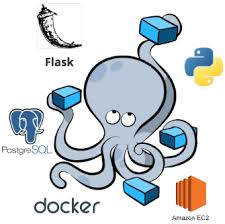
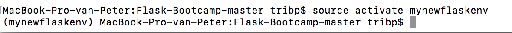

# Flask-Getting-Started




## 0 - Creating Python environment

Best practice is to create a 'Python environment'. This means an environment (or map) were all the needed and correct version of libraries are located. This way there are no conflicts when a component is upgraded on the PC and that the created Python app uses the correct dependencies.

Create the environment
```
conda create -n mynewflaskenv python=3.6
```
Activate the environment
```
source activate mynewflaskenv
```


Now, install all the required libraries with the correct version as given in the txt file
```
pip install -r requirements.txt
```
Simlpe test:
  - run 'python' in terminal -> check if correct version
  - type 'import flask' in python terminal -> if no error flask was installed.  

## 1 Basic commands
### 1.1 docker version
```
docker --version
Docker version 18.03.0-ce, build 0520e24
```
`
